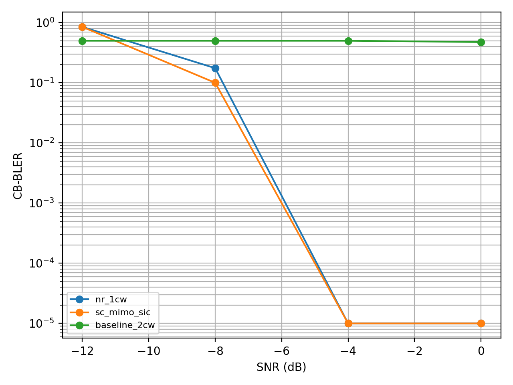
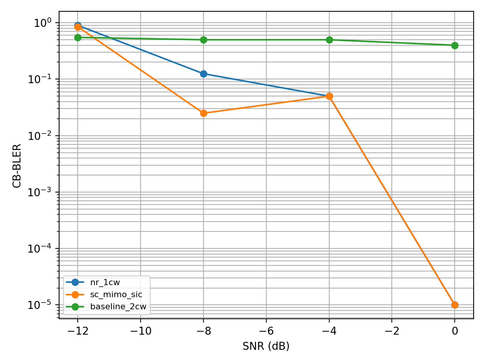
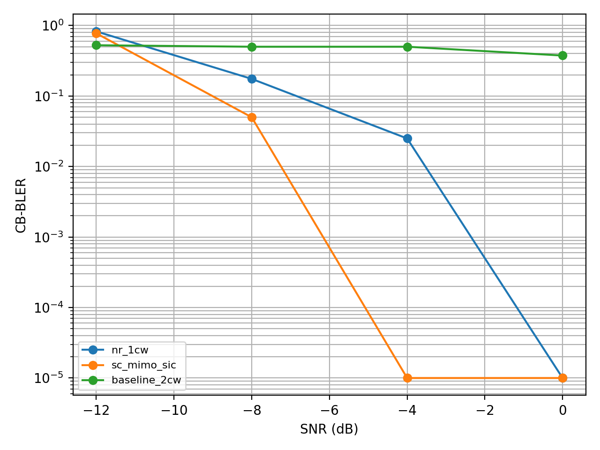
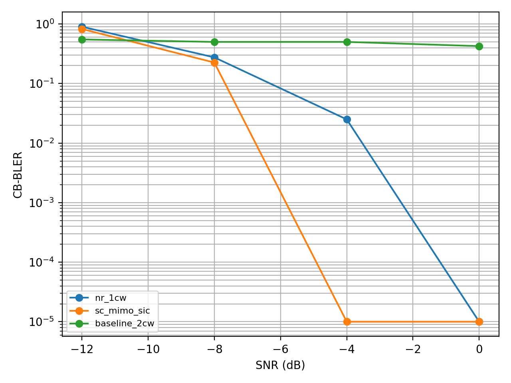
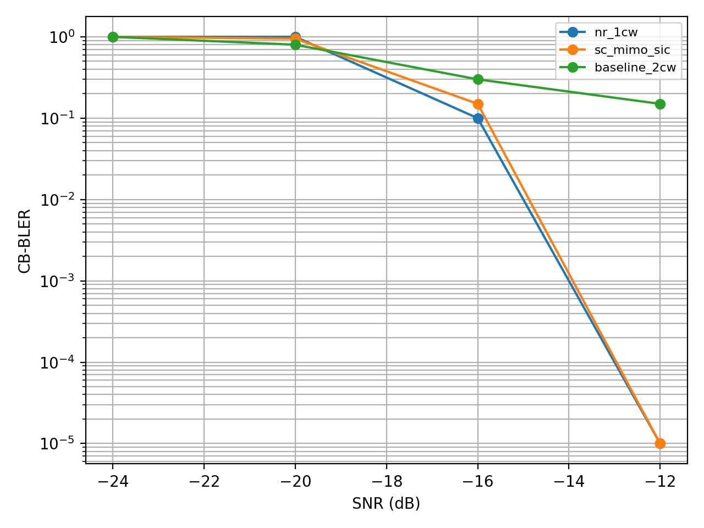
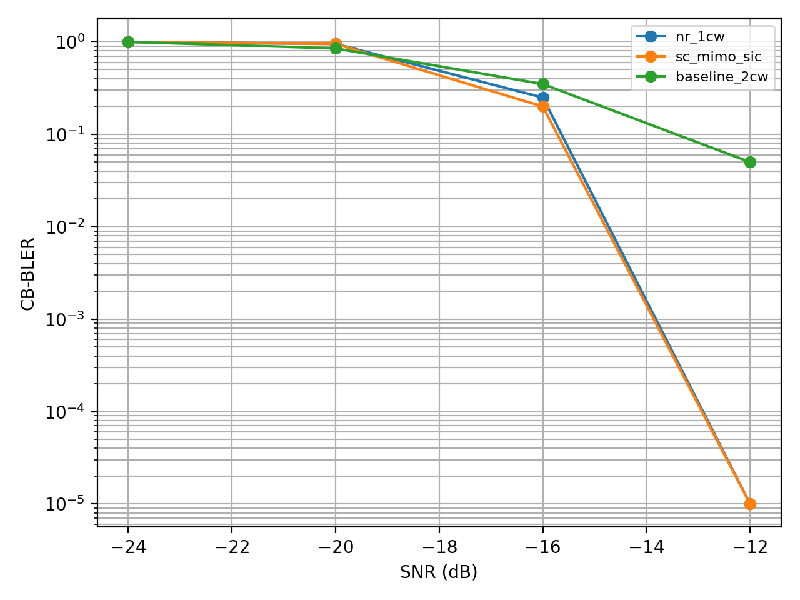
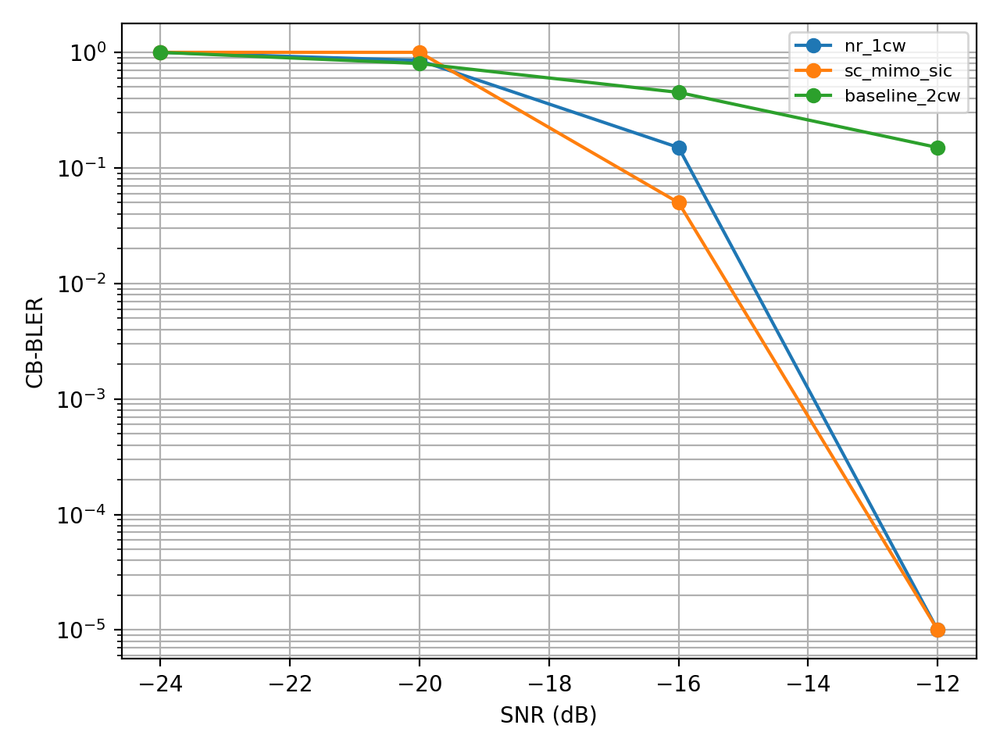
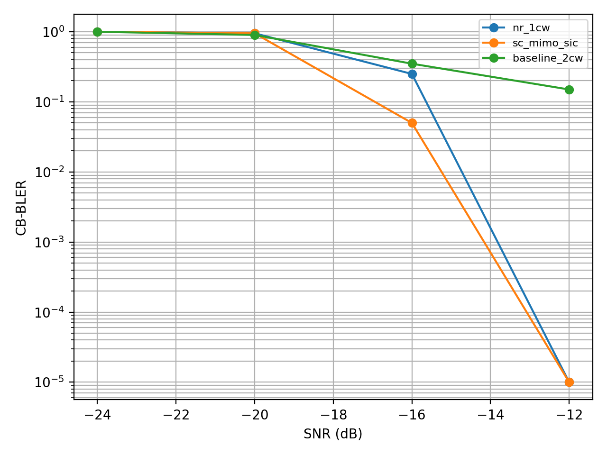

# SC-MIMO 仿真实现计划与验证记录

本文档只记录 SC-MIMO 仿真实现的分阶段任务、目标、调试通过标志和验证记录。原理理解与链路层仿真实现说明见 [SC_MIMO_understanding_and_simulation.md](SC_MIMO_understanding_and_simulation.md)。

## 1. 当前进度总览

当前项目目录：

```text
/Users/zhangwei/Downloads/lls_platform_sc_mimo
```

状态标志：

- `[DONE]`：该阶段的当前验收标准已经通过，后续只做维护或增强。
- `[IN PROGRESS]`：当前正在推进，已有部分前置条件或子任务完成。
- `[TODO]`：尚未开始实现。
- `[BLOCKED]`：被外部依赖或关键决策阻塞。

当前阶段位置：

| 阶段 | 状态 | 当前结论 |
| --- | --- | --- |
| Phase 0：文档与最小数学工具 | `[DONE]` | 文档已拆分，rank2 cyclic mapper、exhaustive detector、focused tests 已通过。 |
| Phase 1a：rank2 true-MIMO toy without LDPC | `[DONE]` | NumPy-only true-MIMO toy、NR/SC-MIMO grid、ideal cancellation 已通过。 |
| Phase 1b：rank2 fixed-MCS with LDPC | `[DONE]` | 单 SNR NR-vs-SC-MIMO full-link smoke 已通过，包含 CB-aware TX branch、TBManager single/multi-CB 参数、LDPC、LLR scatter 和 CB-level SIC。 |
| Phase 1c：rank2 fixed-MCS runnable experiment | `[DONE]` | 已实现固定 seed/SNR sweep 入口，可输出 NR vs SC-MIMO CSV/JSON 和 CB-BLER/goodput 曲线。 |
| Phase 2：理想 CSI 下三方案对比 | `[IN_PROGRESS]` | 已完成 rank4 layer-group mapping、K-best/rML、rML+MMSE-after-SIC、CDL-A/20MHz/15kHz/3&30km/h/32Tx4Rx sampled ideal-SVD sweep；输出 NR 1CW、SC-MIMO-SIC、2CW baseline 图。 |
| Phase 3：非理想 CSI 下对齐 Qualcomm Table 2 | `[IN_PROGRESS]` | 已新增抽象 NMSE 复高斯 CSI 误差 fixed-QPSK BLER sweep；SRS precoder aging、RMMSE/PRG-bundled DMRS CE、OLLA 10% TB-BLER 和完整 Table 2 复现仍待实现。 |
| Phase 4：扩展研究 | `[TODO]` | 多维扫参和机制分析指标尚未实现。 |

已完成的最小实现：

- `lls_platform/phy/sc_mimo_mapping.py`
  - rank2 cyclic staggered CB mapping plan。
  - `CB coded bits -> rank2 SC-MIMO layer grid` 发射端参考 mapper。
  - 单 CB layer grid reconstruction，用作后续 SIC cancellation 的基础。
- `lls_platform/phy/grid_mapping.py`
  - 已有 NR-like CW-to-layer 基本映射，按 RE-major、layer-minor 的顺序把 CW coded-bit stream 路由到 `[RE, layer]` grid。
  - 它不是 SC-MIMO 专用模块，但应作为 NR MIMO baseline 的基本映射复用，并在后续 true-MIMO/rML/SIC 对比中和 SC-MIMO mapping 使用同等 channel、detector 和统计口径。
- `lls_platform/phy/mimo_detection.py`
  - 小规模 exhaustive max-log MIMO detector。
  - 当前用于 rank2/QPSK toy sanity check，不用于大规模仿真。
- `tests/test_sc_mimo_mapping.py`
  - focused tests 覆盖 mapping plan、CB symbol alignment、exhaustive detector、single-CB reconstruction。

当前尚未完成：

- SC-MIMO full-link orchestrator 尚未接入 `run.py`。
- 真实 MIMO channel/residual/SIC loop 尚未接入 LDPC backend。
- rank4 layer-group mapping 尚未实现。
- K-best/rML detector 尚未实现。
- Qualcomm Table 2 preset 尚未落地。
- NR basic mapping 已有 CW/layer 路由基础，但还需要在 SC-MIMO full-link toy simulation 中作为 NR baseline 接入真实 MIMO channel 和同等 rML detector。

### 1.1 当前 SC-MIMO Python 工具说明

当前仓库里已经有一组最小 SC-MIMO Python 工具。它们不是完整链路仿真，而是为了先把 SC-MIMO 的 mapping 语义、toy MIMO detector 和后续 SIC reconstruction 所需对象验证清楚。

后续如果新增代码，应放在对应 phase 下解释：例如 rank2 toy link 相关代码放在 Phase 1，rank4 layer-group 和 K-best/rML 放在 Phase 2，Qualcomm Table 2 preset 和 OLLA 对齐放在 Phase 3。

#### 1.1.1 `sc_mimo_mapping.py`

该模块对应理解文档中的 **rank2 cyclic staggered CB mapping**。

它实现的是：

- `termination=cyclic`。
- `rank=2`。
- 每个 CB 按 QAM symbol stream 分成两个 part。
- `part0` 映射到 layer 0，并按 CB 自然顺序排列。
- `part1` 映射到 layer 1，并按 CB index 做 cyclic shift。
- 每个 CB part 记录 `re_indices`、`bit_indices`、`symbol_indices`，用于后续收发两端按 CB/part 精确定位资源。

在完整发射链路中的位置：

```text
payload bits
  -> TB/CB segmentation
  -> LDPC encode + rate matching
  -> 每个 CB 得到 coded bits c_i[0:E_i]
  -> sc_mimo_mapping.py:
       QAM modulation + CB coded bits/CB symbols -> rank2 SC-MIMO layer grid
  -> precoder / true MIMO channel
```

从概念上说，SC-MIMO mapping 位于 QAM modulation 之后。当前早期验证函数 `map_rank2_cb_bits_to_layer_grid()` 为了简化测试，接口输入仍然是多个 CB 的 coded bits，并在内部调用 QAM mapper，直接输出 shape 为 `[n_re_per_layer, 2]` 的 layer-domain QAM symbol grid。因此它覆盖的是 “QAM modulation + SC-MIMO symbol placement” 这一段。

基本函数调用方法：

```python
from lls_platform.phy.sc_mimo_mapping import (
    build_rank2_cyclic_sc_mimo_plan,
    cb_symbol_counts_from_e,
    map_rank2_cb_bits_to_layer_grid,
    reconstruct_rank2_cb_layer_grid,
)

cb_symbol_counts = cb_symbol_counts_from_e(cb_e_values=[8, 8, 8], qm=2)
plan = build_rank2_cyclic_sc_mimo_plan(
    cb_symbol_counts=cb_symbol_counts,
    qm=2,
    n_re_per_layer=6,
    shift=1,
)
x_layer = map_rank2_cb_bits_to_layer_grid(cb_bits_by_index, plan)
cb0_grid = reconstruct_rank2_cb_layer_grid(cb_bits_by_index[0], cb_index=0, plan=plan)
```

在未来 SIC 接收链路中的位置：

```text
LDPC decoded CB bits 或 ideal true CB bits
  -> re-encode / rate match / re-modulate
  -> sc_mimo_mapping.py:
       reconstruct one CB's layer-grid contribution
  -> y_res = y_res - H_eff x_hat_i
```

其中 `reconstruct_rank2_cb_layer_grid()` 用来重构某一个 CB 在 layer grid 上的贡献。它返回的 grid 只有该 CB 占用的位置非零，其他位置为 0。这正是后续 SIC cancellation 前需要的 `x_hat_i`。

该模块目前没有实现：

- rank4 layer-group mapping。
- `zero_guard` termination。
- strict rectangular tile 的 rate-matching allocation。
- 与 Sionna LDPC orchestrator 的 full-link 接入。
- 真实 MIMO channel、MIMO detection、LDPC decode、SIC loop。

#### 1.1.2 `mimo_detection.py`

该模块对应理解文档中的 **`exhaustive_ml` reference detector**，不是 Qualcomm 复现阶段需要的 K-best/rML 主力 detector。

它实现的是小规模 exhaustive max-log MIMO detection：

```text
输入:
  y: 接收向量，shape [n_rx]
  h: 有效 MIMO 信道，shape [n_rx, rank]
  qm: 每个 QAM symbol 的 bit 数
  noise_var: 噪声方差

处理:
  枚举所有 M^rank 个 QAM vector
  计算 metric = ||y - Hx||^2 / noise_var
  找到 best candidate bits
  用 max-log 近似生成每个 bit 的 LLR

输出:
  best_bits
  llr
  candidate_metrics
```

在完整接收链路中的位置：

```text
received y[RE, rx] + H_eff[RE, rx, rank]
  -> mimo_detection.py:
       per-RE MIMO soft detection
  -> scatter LLR 到 CB bit order
  -> LDPC decode
  -> SIC reconstruction / cancellation
```

当前用途：

- rank2/QPSK 或低阶 QAM toy sanity check。
- 验证 LLR 符号约定：理解文档和当前 detector 使用 `LLR > 0` 硬判为 bit 1。
- 给后续 K-best/rML detector 提供 correctness reference。

当前限制：

- 复杂度随 `rank * qm` 指数增长，因为候选数是 `2^(rank * qm)`，等价于 `M^rank`。
- 不适合 rank4、高阶 QAM、大 batch 或 Qualcomm Table 2 曲线仿真。
- 不包含 MMSE、K-best、sphere/list search，也不包含 channel estimation。

#### 1.1.3 `tests/test_sc_mimo_mapping.py`

该文件是验证层，不是仿真链路的一部分。它用于确认当前最小数学工具没有偏离预期。

它覆盖：

- rank2 cyclic staggered CB mapping 的 layer 顺序和 CB 顺序。
- 每个 CB 的 bit/symbol coverage 是否完整且不重复。
- `E % Qm == 0` 的 CB symbol alignment 检查。
- noiseless rank2 QPSK exhaustive MIMO detector 能否恢复发送 bits。
- 单 CB reconstruction 是否满足：

```text
sum(reconstruct_rank2_cb_layer_grid(CB_i) for all CB_i)
  == map_rank2_cb_bits_to_layer_grid(all CBs)
```

这三个 Python 文件不是完全独立的单文件脚本。它们依赖：

- `numpy`。
- `lls_platform/phy/numpy_qam.py` 中的 `qam_modulate()`。
- 从项目根目录运行，使 Python 能导入 `lls_platform` 包。

但它们不依赖：

- Sionna。
- TensorFlow。
- CDL channel builder。
- `run.py`。
- 现有 Sionna LDPC orchestrator。

因此，这组测试通过只说明当前最小工具正确，包括 rank2 cyclic mapping、symbol coverage、exhaustive detector 和 single-CB reconstruction。它不代表 full-link SC-MIMO 仿真已经实现，也不代表已经验证了 Qualcomm 提案中的最终性能收益。

当前测试文件中的关键输入例子：

```python
plan = build_rank2_cyclic_sc_mimo_plan(
    cb_symbol_counts=[6, 6, 6],
    qm=4,
    n_re_per_layer=9,
    shift=1,
)
```

该例子有 3 个 CB，每个 CB 有 6 个 QAM symbols，`qm=4` 表示 16QAM。每个 CB 被拆成两个 3-symbol parts，测试期望得到：

```text
layer 0 CB order = [0, 1, 2]
layer 1 CB order = [2, 0, 1]
```

也就是：

```text
RE index:  0-2        3-5        6-8
layer 0:   CB0 p0     CB1 p0     CB2 p0
layer 1:   CB2 p1     CB0 p1     CB1 p1
```

另一个 mapper/reconstruction 测试输入是：

```python
plan = build_rank2_cyclic_sc_mimo_plan(
    cb_symbol_counts=[4, 4, 4],
    qm=2,
    n_re_per_layer=6,
    shift=1,
)
cb_bits = [
    np.asarray([0, 0, 0, 1, 1, 0, 1, 1], dtype=np.int8),
    np.asarray([1, 1, 1, 0, 0, 1, 0, 0], dtype=np.int8),
    np.asarray([0, 1, 1, 1, 1, 0, 0, 0], dtype=np.int8),
]
```

这里 `qm=2` 表示 QPSK，每个 CB 有 4 个 QAM symbols，并被拆成两个 2-symbol parts。测试验证完整 grid 等于每个 CB 单独 reconstruction 的相加结果，这为后续 SIC cancellation 提供基础。

## 2. Phase 0 [DONE]：文档与最小数学工具

状态：已完成第一版，后续随实现继续维护。

目标：

- 拆分理解说明和实现计划文档。
- 明确 SC-MIMO TX/RX 设计。
- 新增 CB-aware staggered mapping utility。
- 新增小规模 MIMO exhaustive max-log detector，用于 sanity check。

调试通过标志：

- rank2 cyclic staggered CB mapping 无资源冲突。
- 每个 CB 的 part0/part1 覆盖全部 symbol/bit indices，且不重复。
- CB `E` 到 QAM symbol count 的转换会检查 `E % Qm == 0`。
- 小规模 rank2 QPSK exhaustive MIMO detector 在 noiseless 条件下能恢复 bits。
- detector 输出符合文档定义的 LLR 符号约定：`LLR > 0` 硬判为 bit 1。
- 发射端参考 mapper 可以执行 `CB coded bits -> rank2 SC-MIMO layer grid`。
- 所有 CB 的单独 grid reconstruction 相加等于完整发射 grid。

已验证命令：

```bash
cd /Users/zhangwei/Downloads/lls_platform_sc_mimo
python3 -B -m unittest tests.test_sc_mimo_mapping
```

当前验证记录：

```text
Ran 4 tests in 0.001s
OK
```

## 3. Phase 1 [IN PROGRESS]：rank2 fixed-MCS toy link

目标：

- 不接 OLLA。
- 不接 SRS aging。
- 使用真实 `H_eff`，先使用 flat Rayleigh 或 small CDL batch。
- 复用或接入 NR basic mapping，作为 NR MIMO baseline。
- 比较 NR mapping 和 SC-MIMO mapping 的 CB-BLER。
- 支持 no-SIC / ideal-SIC / decoded-SIC 三类接收路径。
- 新增 `lls_platform/sim/sc_mimo_orchestrator.py`，先实现 rank2 fixed-MCS toy link：

```text
LDPC encode
  -> SC-MIMO mapping
  -> true MIMO channel
  -> exhaustive detector
  -> ideal/decoded SIC
  -> LDPC decode
```

### 3.1 Phase 1a [DONE]：rank2 true-MIMO toy without LDPC

状态：已通过第一版验证。

范围：

- 不接 LDPC，不统计正式 BLER。
- 直接使用人工构造的 CB bits/QAM symbols。
- 同时构造 NR mapping 和 SC-MIMO mapping 的 rank2 `[RE, layer]` grid。
- 使用 flat true `H_eff[RE, rx, rank]`，可先固定为小规模 deterministic channel。
- 使用 exhaustive detector 验证 per-RE MIMO detection。
- 只实现 no-SIC 和 ideal-SIC，先验证 SIC cancellation 的数学链路。

验证通过：

- NR mapping 和 SC-MIMO mapping 都能生成 shape 正确、无资源冲突的 `[RE, layer]` grid。
- `y = H_eff x + n` 的 true-MIMO 路径跑通，且没有退化成 diagonal SVD equivalent。
- noiseless 条件下，exhaustive detector 能恢复每个 RE/layer 上的发送 bits。
- 对某个 CB 做 ideal reconstruction 后，`y_res = y - H_eff x_cb` 的 residual energy 在 noiseless 条件下接近数值误差。
- SC-MIMO cyclic overlap 符合预期，例如 `shift=1`、3 个 CB 时 layer1 顺序为 `[CB2, CB0, CB1]`。
- NR baseline 和 SC-MIMO 使用同一组 `H_eff`、noise seed、detector 和统计口径。

当前实现记录：

- 新增 `lls_platform/sim/sc_mimo_orchestrator.py`，提供 NumPy-only Phase 1a toy utilities：
  - `map_nr_rank2_cb_bits_to_layer_grid()`：构造 NR rank2 RE-major/layer-minor baseline grid。
  - `deterministic_rank2_channel()`：构造 deterministic full `H_eff[RE, rx, rank]`。
  - `apply_true_mimo_channel()`：执行 `y[RE] = H_eff[RE] x_layer[RE] + n`。
  - `exhaustive_detect_layer_grid()`：对每个 RE 调用 exhaustive MIMO detector。
  - `collect_nr_rank2_cb_bits_from_detection()` / `collect_scmimo_cb_bits_from_detection()`：把 detector hard bits 收回 CB bit order。
  - `residual_after_ideal_cb_cancellation()`：执行 ideal CB contribution cancellation。
- 新增 `tests/test_sc_mimo_phase1a.py`，覆盖 NR/SC-MIMO noiseless true-MIMO detection 和 ideal CB cancellation residual。

当前验证记录：

```bash
/Users/zhangwei/.cache/codex-runtimes/codex-primary-runtime/dependencies/python/bin/python3 -B -m unittest tests.test_sc_mimo_phase1a
```

结果：

```text
Ran 2 tests in 0.006s
OK
```

### 3.2 Phase 1b [DONE]：rank2 fixed-MCS with LDPC

状态：已完成。单 SNR NR-vs-SC-MIMO full-link smoke 已通过，包含 CB-aware TX branch、`TBManager` single/multi-CB 参数、LDPC、LLR scatter、CB-level decoded-SIC 和 high-SNR metrics 输出。

范围：

- 接入 TB/CB segmentation。
- 接入 LDPC encode/decode 和 rate matching。
- 接入 detector LLR 到 CB bit order 的 scatter。
- 统计 CB-level decode result。
- 仍不接 OLLA，不接 SRS aging。
- 支持 no-SIC / ideal-SIC / decoded-SIC 三种接收路径。

Phase 1b 的明确目标：

- 在单个 SNR 或少量固定 SNR 点下，打通 rank2、fixed-MCS、single-CW SC-MIMO full-link smoke。
- 这里的 full-link smoke 指：

```text
payload bits
  -> TB/CB segmentation
  -> LDPC encode
  -> SC-MIMO CB-aware mapping
  -> true H_eff MIMO channel
  -> MIMO soft detector
  -> CB LLR scatter
  -> LDPC decode
  -> CB-level SIC cancellation
  -> CB-BLER / TB-BLER / goodput
```

- Phase 1b 要证明的是链路控制流、CB 边界、LLR 顺序、LDPC decode、SIC gating 和 cancellation reconstruction 都是通的。
- Phase 1b 不追求 Qualcomm Figure 17/18 的性能结论，也不追求 detector 复杂度可扩展；正式可重复实验和 SNR sweep 放到 Phase 1c，rank4/K-best/rML 放到 Phase 2。

Phase 1b 中 “CB-level SIC toy receiver” 的含义：

- `CB-level`：SIC 的最小解码/抵消单位是 CB。某个 CB 解码成功后，接收机用该 CB 的 decoded payload bits 重新编码、重新映射，重构这个 CB 对应的 layer-grid contribution。
- `SIC`：用当前 residual received signal 减去这个 CB 的信道贡献：

```text
x_hat_cb = remap(re-encode(decoded_cb))
y_res = y_res - H_eff x_hat_cb
```

- `toy receiver`：当前使用 rank2/QPSK/小规模 exhaustive detector 和 deterministic/small true `H_eff`，目标是验证数学链路和接口正确性。
- decoded-SIC 的 gating 规则：只有 CB decode 成功时才允许重编码并抵消；失败 CB 不抵消，避免 error propagation。
- ideal-SIC 使用真实 coded bits 做抵消，只用于上界/排错；它不是实际接收机。

与 Qualcomm Table 2 中 rML/K-best 大规模 receiver 的区别：

| 项目 | Phase 1b CB-level SIC toy receiver | Qualcomm Table 2 / 后续 Phase 2-3 receiver |
| --- | --- | --- |
| 目标 | 验证 SC-MIMO 链路机制是否跑通 | 复现/研究性能曲线和复杂度 |
| rank | rank2 为主 | rank2/rank4，后续可扩展 |
| detector | exhaustive ML reference，小配置可用 | rML/K-best/list detector，面向高阶 QAM/rank4 |
| 复杂度 | 随 `M^rank` 指数增长，不可大规模扫参 | 受限候选搜索，复杂度可控 |
| channel | deterministic/flat true `H_eff` toy | CDL-A、SRS SVD aging、PRG bundling 等 |
| SIC | CB-level ideal/decoded gating correctness | rML/rML+MMSE after SIC 等更真实接收机结构 |
| 输出 | smoke 级 CB/TB/goodput 和 residual 检查 | throughput-vs-SNR、CB/TB BLER、SIC failure、CDF |

因此，Phase 1b 完成后可以说：rank2 fixed-MCS SC-MIMO 在单 SNR toy full-link 下已经从发射端跑到接收端，并包含 CB-level SIC receiver。不能说：已经复现 Qualcomm Table 2 的 rML/K-best 性能。

验证通过：

- 每个 CB 的 `E` 与 mapping plan 对齐，至少满足 `E % Qm == 0`；strict tile 模式下进一步满足 `E % (Qm * rank) == 0`。
- decoder adapter 的 LLR 符号约定被显式验证；如果 Sionna decoder 期望相反符号，只在 adapter 层统一翻转。
- no-SIC、ideal-SIC、decoded-SIC 三种路径都能输出 CB-BLER、TB-BLER 和 goodput。
- high-SNR 或 noiseless/near-noiseless case 中，NR baseline 和 SC-MIMO 都应接近全通过，用于排除 mapping/scatter/decoder 方向错误。
- decoded-SIC 只在 CB decode 成功或 CRC/判定通过时消除；失败 CB 不应被错误消除。
- ideal-SIC 在存在明显层间干扰的 toy 场景中优于 no-SIC。

当前执行记录：

- 已新建本地环境 `.venv-sionna1`，用于对齐服务器侧 Sionna 1.x/TensorFlow 代码路径。
- `.venv-sionna1` 使用 Python `3.10.20`、TensorFlow `2.19.1`、Sionna `1.2.0`。
- 已验证 `sionna.phy.fec.ldpc.LDPC5GEncoder/LDPC5GDecoder` 可导入。
- 已验证当前本地机器未发现 GPU；本地运行通过 `CUDA_VISIBLE_DEVICES=-1` 强制 CPU 路径，服务器运行时可不设置该变量以使用 GPU。
- bundled Python 仍不安装 TensorFlow/Sionna；后续 Phase 1b/LDPC 相关命令应使用 `.venv-sionna1/bin/python`。
- 新增 `lls_platform/sim/sc_mimo_orchestrator.py` 中的 Phase 1b 工具：
  - `SionnaLDPCAdapter`：最小单 batch Sionna LDPC encode/decode adapter。
  - `collect_nr_rank2_cb_llrs_from_detection()`：把 NR rank2 `[RE, layer, bit]` LLR 收回 CB coded-bit order。
  - `collect_scmimo_cb_llrs_from_detection()`：按 SC-MIMO mapping plan 把 detector LLR 收回每个 CB 的 coded-bit order。
  - `exhaustive_detect_layer_grid_with_known_symbols()`：SIC 后把已抵消 layer symbol 当作 known symbol，再对剩余层做 exhaustive detection。
  - `run_rank2_ldpc_true_mimo_trial()`：执行单次 rank2 toy trial，覆盖 LDPC encode、NR/SC-MIMO mapping、true `H_eff`、detector LLR、LDPC decode、CB goodput 和 SC-MIMO ideal/decoded SIC gating。
  - `build_rank2_fixed_mcs_tb_setup()`：复用现有 `FlexibleCWScheme + TBManager`，根据 resource、rank2、fixed MCS 生成 `TBInfo`、CB payload lengths、每个 CB 的 `E`、`Qm` 和 `n_re_per_layer`。
  - `run_rank2_ldpc_true_mimo_trial_from_tb_manager()`：用 `TBManager` 生成的 CB 参数驱动 Phase 1b trial，不再只依赖测试里手写的 `k/E`。
  - `map_nr_encoded_cbs_to_layer_grid()`：NR baseline TX branch，把同一批 encoded CB bits concat 成普通 CW stream 后映射到 rank2 layer grid。
  - `map_sc_mimo_encoded_cbs_to_layer_grid()`：SC-MIMO TX branch，显式接收 `encoded_cb_bits_by_index=[c_cb0, c_cb1, ...]`，保留 CB 边界并返回 `SCMIMOGridMappingPlan`。
  - `run_rank2_phase1b_single_snr_comparison()`：Phase 1b 完成态入口；同一批 payload bits 只 LDPC encode 一次，然后把同一批 encoded CB bits 分叉到 NR baseline、SC-MIMO no-SIC、SC-MIMO ideal-SIC、SC-MIMO decoded-SIC。
- 新增 `tests/test_sc_mimo_phase1b.py`：
  - 验证 Sionna LDPC decoder 与当前 detector 一致使用 `LLR > 0 => bit 1`。
  - 验证同一批 encoded CB bits 可以分叉成 NR baseline grid 和 SC-MIMO grid，且 SC-MIMO branch 保留 3 个 CB 的 boundary 和 cyclic layer order。
  - 验证 rank2 NR baseline 在 noiseless true-MIMO toy 条件下 LDPC 解码全通过。
  - 验证 rank2 SC-MIMO 的 `no_sic`、`decoded_sic`、`ideal_sic` 三条路径都能输出 CB/TB/goodput 结果，并在 noiseless 条件下全通过。
  - 验证 decoded-SIC 只在 CB 解码成功时执行 cancellation；noiseless case 中 3 个 CB 都通过，因此 cancellation count 为 3。
  - 验证 `TBManager` 生成的 rank2/fixed-MCS CB 参数能驱动 SC-MIMO decoded-SIC toy trial，并且 `sum(E_cb) == n_re_per_layer * rank * Qm`。
  - 验证 `noise_var=1e-5` 的 high-SNR smoke 能输出合法 CB-BLER、TB-BLER、goodput，并在当前 deterministic channel 下通过。
  - 验证 `run_rank2_phase1b_single_snr_comparison()` 能在单 SNR 下同时跑通 NR baseline、SC-MIMO no-SIC、SC-MIMO ideal-SIC、SC-MIMO decoded-SIC。
  - 验证 `TBManager` 生成的 multi-CB 配置也能跑通 full-link smoke；当前配置 `n_prbs=31`、`pdsch_n_symbols=13`、fixed MCS 3 会生成多个 CB，并通过 SC-MIMO decoded-SIC。

Phase 1b 新增工具说明：

- `SionnaLDPCAdapter`
  - 它是 Phase 1b 的最小 LDPC 编解码适配层，不是完整仿真器。
  - 输入是每个 CB 的 payload bits 和目标编码长度 `E`，内部为每个 CB 构造一个 Sionna `LDPC5GEncoder(k, n=E)` 和对应 `LDPC5GDecoder`。
  - 发射侧位置：`payload bits -> SionnaLDPCAdapter.encode() -> 每个 CB 的 coded bits`。
  - 接收侧位置：`每个 CB 的 coded-bit LLR -> SionnaLDPCAdapter.decode() -> decoded payload bits / CB success / TB success / goodput`。
  - 当前限制：它仍是独立 adapter，用于连接 true-MIMO detector 和 LDPC decoder；正式链路应继续向现有 `sionna_ldpc_orchestrator.py` 的 TB/CB 统计口径靠拢。当前把 Sionna encoder 的输出长度 `n` 直接当作 rate-matched length `E`，还没有拆出完整 NR rate-matching/de-rate-matching adapter。

- `build_rank2_fixed_mcs_tb_setup()` / `run_rank2_ldpc_true_mimo_trial_from_tb_manager()`
  - 这两个函数用于回答“Phase 1b 是否已经开始复用现有链路层 CB 划分”的问题。
  - `build_rank2_fixed_mcs_tb_setup()` 使用现有 `FlexibleCWScheme` 生成 rank2 single-CW transmission config，再调用 `TBManager.compute_for_transmission()` 得到 `TBInfo`。
  - 它从 `TBInfo` 中读取 `tb_size`、`n_cbs`、`CBInfo.E`、`n_re_per_layer`，并按现有 Sionna orchestrator 的口径把 `tb_size` 分到每个 CB 的 payload length。
  - `run_rank2_ldpc_true_mimo_trial_from_tb_manager()` 再用这些 payload lengths 和 `E` 运行一次 NR 或 SC-MIMO toy LDPC trial。
  - 当前验证配置是 rank2、fixed MCS 3、`n_prbs=6`、`pdsch_n_symbols=4`，生成 1 个 CB：payload length `280`、`E=1152`、`Qm=2`、`n_re_per_layer=288`。
  - 当前限制：这个测试已复用 `TBManager` 的尺寸生成，但还没有覆盖多个 TBManager-generated CB；multi-CB SIC 仍由小尺寸手工 smoke 覆盖。

- NR/SC-MIMO 的 CB LLR scatter
  - MIMO detector 的自然输出是 `[RE, layer, bit]`，但 LDPC decoder 需要的是每个 CB 自己的 coded-bit 顺序。
  - `collect_nr_rank2_cb_llrs_from_detection()` 用 NR rank2 的 RE-major/layer-minor 顺序，把 detector LLR 还原成 `[CB0 LLR, CB1 LLR, ...]`。
  - `collect_scmimo_cb_llrs_from_detection()` 使用 `SCMIMOGridMappingPlan` 中记录的 `re_indices` 和 `bit_indices`，把 staggered mapping 后的 LLR 精确放回每个 CB 的 coded-bit order。
  - 它在接收链路中的位置是：`MIMO soft detector -> CB LLR scatter -> LDPC decode`。
  - 这一步是验证 SC-MIMO 是否可解码的关键。如果 scatter 顺序错了，即使 detector 输出正确，LDPC decoder 也会看到乱序 LLR。

- SIC 后 known-symbol exhaustive detector
  - 对应函数是 `exhaustive_detect_layer_grid_with_known_symbols()`。
  - SIC 抵消某些 CB 后，这些 CB 占用的 layer symbols 已经是 known symbols；后续检测时不应该再把它们当作未知 QAM 候选枚举。
  - 该 detector 会先从接收信号中减去 known symbols 的贡献，再只对剩余未知 layer symbols 做 exhaustive search。
  - 它在接收链路中的位置是：`decoded/ideal CB cancellation -> known-symbol MIMO detection -> 后续 CB LLR scatter`。
  - 当前用途是 rank2/QPSK toy correctness，不是后续 Qualcomm 曲线需要的 K-best/rML 主力 detector。

- `run_rank2_ldpc_true_mimo_trial()`
  - 它是 Phase 1b 的单次 toy trial 编排函数，用来把上述模块串起来。
  - 当前覆盖流程：

```text
payload bits by CB
  -> SionnaLDPCAdapter encode
  -> NR mapping 或 SC-MIMO cyclic mapping
  -> true H_eff MIMO channel
  -> exhaustive detector
  -> CB LLR scatter
  -> SionnaLDPCAdapter decode
  -> CB-BLER / TB-BLER / goodput
  -> 可选 ideal-SIC / decoded-SIC cancellation
```

  - `mapping="nr"` 用作 NR baseline；`mapping="sc_mimo"` 用作当前 rank2 cyclic SC-MIMO baseline。
  - `sic_mode="no_sic"` 表示不做 CB cancellation；`ideal_sic` 使用真实 coded bits 做理想抵消；`decoded_sic` 只在 CB 解码成功时重编码并抵消。
  - 当前它不是 Phase 1c 的正式实验入口：还不支持 config、固定 seed SNR sweep、CSV/JSON 落盘，也还没有接入 `run.py`。

preflight 命令：

```bash
MPLCONFIGDIR=/Users/zhangwei/Downloads/lls_platform_sc_mimo/.mpl_cache \
CUDA_VISIBLE_DEVICES=-1 \
.venv-sionna1/bin/python - <<'PY'
import sys
import tensorflow as tf
import sionna
from sionna.phy.fec.ldpc import LDPC5GEncoder, LDPC5GDecoder

print(sys.version.split()[0])
print("tensorflow", tf.__version__)
print("sionna", sionna.__version__)
print("LDPC OK")
print("physical GPUs", tf.config.list_physical_devices("GPU"))
PY
```

结果：

```text
3.10.20
tensorflow 2.19.1
sionna 1.2.0
LDPC OK
physical GPUs []
```

项目 backend 检查命令：

```bash
MPLCONFIGDIR=/Users/zhangwei/Downloads/lls_platform_sc_mimo/.mpl_cache \
CUDA_VISIBLE_DEVICES=-1 \
.venv-sionna1/bin/python - <<'PY'
from lls_platform.sim.sc_mimo_orchestrator import ldpc_backend_available
ok, reason = ldpc_backend_available()
print('ldpc_backend_available=', ok)
print('reason=', reason)
PY
```

结果：

```text
ldpc_backend_available= True
reason= tensorflow 2.19.1, sionna 1.2.0, LDPC/Mapper OK
```

Phase 1b 完成结论：

- SC-MIMO TX branch 已经显式保留 CB 边界，输入为 `encoded_cb_bits_by_index=[c_cb0, c_cb1, ...]`。
- NR baseline 和 SC-MIMO branch 已经可以从同一批 encoded CB bits 分叉，保证同一 payload、同一 LDPC code、同一 `CBInfo.K/E`、同一 MCS 和同一 `H_eff/noise`。
- `TBManager` single-CB 和 multi-CB 生成路径都已经进入 smoke test。
- `LDPC5GEncoder(k,n=E)` 的边界已明确：Phase 1b mapper 接收的是 Sionna 已经 rate-matched 到长度 `E` 的 coded bits。完整拆分 mother codeword/rate-matching/de-rate-matching 不属于 Phase 1b，后续如需替换 Sionna 内部 rate matching，再作为独立重构任务处理。
- Phase 1b 不负责 SNR sweep、CSV/JSON 落盘或正式曲线；这些进入 Phase 1c。

Phase 1b 已实现设计：如何让 SC-MIMO branch 输入保留 CB 边界：

- 现有 NR/Sionna 链路已经有 CB 边界，只是在普通 NR grid mapping 前把它们串成了 CW coded-bit stream：

```text
payload_bits_by_cw[cw_idx][cb_idx]
  -> 每个 CB 独立 LDPC encode
  -> encoded_by_cw_parts[cw_idx] = [c_cb0, c_cb1, ...]
  -> NR baseline:
       cw_bits = concat([c_cb0, c_cb1, ...], axis=-1)
       cw_bits -> GridMappingPlan -> NR layer grid
```

- SC-MIMO branch 不应该只接收 `cw_bits`，而应该接收 concat 前的结构：

```text
encoded_cb_bits_by_cw = {
  0: [c_cb0, c_cb1, c_cb2, ...]
}
```

- 对 rank2 single-CW SC-MIMO，第一版函数接口可以是：

```python
def map_sc_mimo_encoded_cbs_to_layer_grid(
    encoded_cb_bits_by_index: list[np.ndarray],
    cb_e_values: list[int],
    qm: int,
    n_re_per_layer: int,
    termination: str = "cyclic",
) -> tuple[np.ndarray, SCMIMOGridMappingPlan]:
    ...
```

- 这个函数内部做三件事：
  - 用 `cb_e_values` 和 `qm` 生成 `cb_symbol_counts`，并检查每个 `E % Qm == 0`。
  - 构建 `SCMIMOGridMappingPlan`，记录每个 CB part 的 `(re_indices, layer_index, bit_indices)`。
  - 调用 SC-MIMO mapper，把每个 CB 的 coded bits 放到 rank2 `[RE, layer]` grid。

- 对比 NR baseline 时，两条 branch 必须从同一批 encoded CB bits 分叉：

```text
同一批 payload bits
  -> 同一组 LDPC encoder
  -> 同一批 encoded CB bits [c_cb0, c_cb1, ...]
       -> NR branch:
            concat CBs -> NR GridMappingPlan -> x_nr[RE, layer]
       -> SC-MIMO branch:
            keep CB list -> SCMIMOGridMappingPlan -> x_sc[RE, layer]
```

- 因此 SC-MIMO branch/orchestrator 可以对比 SC-MIMO 和 NR baseline。关键是实验入口必须保证：
  - 两者使用同一批 payload bits。
  - 两者使用同一组 `CBInfo.K/E`、同一 MCS、同一 `Qm`、同一 `n_re_per_layer`。
  - 两者使用同一个 `H_eff`、noise seed、detector 和统计函数。
  - NR branch 的 LLR 用 NR route scatter 回 CB order；SC-MIMO branch 的 LLR 用 `SCMIMOGridMappingPlan` scatter 回 CB order。
  - 输出指标同口径：CB-BLER、TB-BLER、goodput、SIC cancellation count、residual energy。

- 当前工程实现：
  - 已在 `lls_platform/sim/sc_mimo_orchestrator.py` 内新增最小 branch function，没有直接改大体量 `sionna_ldpc_orchestrator.py`。
  - SC-MIMO TX branch 的输入是 `encoded_cb_bits_by_index`；如果输入是 payload，则 Phase 1b comparison 入口内部先调用 LDPC adapter 生成 `encoded_cb_bits_by_index`。
  - Phase 1c 再把这个 branch function 包成固定 seed/SNR sweep 的 runnable experiment。

为什么要“显式保留 CB 边界”：

- 当前 smoke 里虽然也有 CB list，但它还没有形成一个清晰的 branch 接口；逻辑仍然主要包在 `run_rank2_ldpc_true_mimo_trial()` 内部。这样能做测试，但不利于后续接入主链路。
- SC-MIMO mapping 的基本单位不是整个 CW，而是 CB part。mapper 必须知道：
  - 每个 CB 的 coded bits 从哪里开始、在哪里结束。
  - 每个 CB 要被拆成哪些 part。
  - 每个 part 被放到哪个 layer 和哪些 RE。
  - SIC 时某个 decoded CB 应该重构哪些 `(RE, layer)` 位置。
- 如果只给 mapper 一个扁平的 `cw_bits`，CB 边界就丢失了。后续只能再靠额外 offset 表猜测 CB0/CB1/CB2 的范围，这容易让 TX mapping、RX LLR scatter、SIC reconstruction 三者不一致。
- 显式输入 `encoded_cb_bits_by_index = [c_cb0, c_cb1, ...]` 的好处是：
  - SC-MIMO TX mapping 直接以 CB 为单位生成 mapping plan。
  - RX LLR scatter 可以用同一个 mapping plan 回到每个 CB 的 coded-bit order。
  - decoded-SIC 可以精确重构单个 CB 的 contribution。
  - NR baseline 仍然公平：它只是把同一批 CB coded bits concat 成普通 CW stream。

为什么要明确 rate matching/de-rate-matching 与 `LDPC5GEncoder(k,n)` 的边界：

- 现有 smoke 里使用的是 Sionna `LDPC5GEncoder(k, n=E)`。在 Sionna 里，这个 encoder 通常已经把 5G LDPC 编码和 rate matching 目标长度 `n` 包在一起了。
- 因此当前 Phase 1b 的数据边界实际上是：

```text
payload bits length k
  -> LDPC5GEncoder(k, n=E)
  -> rate-matched coded bits length E
  -> QAM mapping / SC-MIMO mapping
```

- 这对 smoke test 是可以的，因为 SC-MIMO mapper 需要的正是长度为 `E` 的 coded bits。但文档和代码必须明确：这里的 `c_cb` 已经是 rate-matched 后的 coded bits，不是 mother LDPC codeword。
- 接收端同理，MIMO detector 输出的是长度为 `E` 的 coded-bit LLR。若使用 Sionna decoder，当前路径相当于：

```text
detector LLR length E
  -> LDPC5GDecoder(encoder built with k,n=E)
  -> payload bits length k
```

- 如果后续自己实现或显式拆出 NR rate matching/de-rate-matching，则边界会变成：

```text
payload bits
  -> LDPC mother codeword
  -> rate matching to E
  -> mapping/channel/detector
  -> de-rate matching from E
  -> LDPC decode
```

- 这个边界必须明确的原因：
  - SC-MIMO mapping 应该作用在 rate-matched coded bits 上，而不是未 rate-matched mother codeword 上。
  - `E` 决定 QAM symbol 数，也决定 CB part 的长度；如果 `E` 和 mapper plan 不一致，资源映射会错。
  - SIC 重构时必须重复完全相同的 encode/rate-match/mapping 过程，否则 `x_hat_cb` 和原发送 CB contribution 对不上。
  - 与原有 `sionna_ldpc_orchestrator.py` 复用时，不能重复 rate matching，也不能跳过 Sionna 已经做掉的 rate matching。

Phase 1b 当前验证命令：

```bash
MPLCONFIGDIR=/Users/zhangwei/Downloads/lls_platform_sc_mimo/.mpl_cache \
CUDA_VISIBLE_DEVICES=-1 \
.venv-sionna1/bin/python -B -m unittest \
  tests.test_sc_mimo_mapping \
  tests.test_sc_mimo_phase1a \
  tests.test_sc_mimo_phase1b
```

结果：

```text
Ran 13 tests in 9.883s
OK
```

### 3.3 Phase 1c [DONE]：rank2 fixed-MCS runnable experiment

状态：已完成第一版。已实现一条命令运行 rank2 fixed-MCS toy SNR sweep，并输出 NR vs SC-MIMO 对比曲线。

范围：

- 新增最小 config 或 run entry，把 Phase 1b 封装成可重复运行实验。
- 支持固定 seed。
- 支持 SNR sweep。
- 支持 NR mapping vs SC-MIMO mapping 对比。
- 支持 SC-MIMO decoded-SIC 作为主曲线；`no-SIC` 和 `ideal-SIC` 只作为调试/消融结果。
- 输出 CSV/JSON 或等价 summary。

验证通过：

- 一条命令可以运行 rank2 fixed-MCS toy experiment。
- 同一 seed、同一 config 下结果可复现。
- 输出中明确包含 NR baseline 和 SC-MIMO 两类 mapping。
- 输出中明确包含 NR baseline 和 SC-MIMO decoded-SIC 主对比；`no-SIC`、`ideal-SIC` 可作为 debug/ablation 统计保留。
- NR baseline 与 SC-MIMO 使用同等 channel、noise、detector、MCS 和统计口径。
- 结果至少包含 CB-BLER、TB-BLER、goodput 或 throughput summary。

当前实现记录：

- 新增 `run_rank2_phase1c_snr_sweep()`：
  - 输入 SNR 列表、trial 数、fixed MCS、seed、resource config 和 output dir。
  - 每个 SNR/trial 调用 Phase 1b comparison 入口。
  - 输出四条同口径 scheme：`nr_no_sic`、`sc_mimo_no_sic`、`sc_mimo_ideal_sic`、`sc_mimo_decoded_sic`。
  - 正式观察主线应看 `nr_no_sic` 与 `sc_mimo_decoded_sic`；`sc_mimo_no_sic` 和 `sc_mimo_ideal_sic` 是调试/消融曲线，不是 Qualcomm 对齐主曲线。
  - 聚合为现有平台的 `SNRSummary` / `CWSimulationStats` 口径。
- 新增 `tools/run_sc_mimo_phase1c.py`：
  - 可直接从项目根目录运行。
  - 输出 `results.csv`、`results.json`、`cb_bler_vs_snr.png`、`goodput_se_vs_snr.png`。

运行命令：

```bash
MPLCONFIGDIR=/Users/zhangwei/Downloads/lls_platform_sc_mimo/.mpl_cache \
CUDA_VISIBLE_DEVICES=-1 \
.venv-sionna1/bin/python tools/run_sc_mimo_phase1c.py \
  --snr-db=-2,0,2,4,6 \
  --trials 2 \
  --fixed-mcs 3 \
  --seed 123 \
  --output-dir results/sc_mimo_phase1c_rank2_fixed_mcs_demo
```

本次输出：

```text
results/sc_mimo_phase1c_rank2_fixed_mcs_demo/results.csv
results/sc_mimo_phase1c_rank2_fixed_mcs_demo/results.json
results/sc_mimo_phase1c_rank2_fixed_mcs_demo/cb_bler_vs_snr.png
results/sc_mimo_phase1c_rank2_fixed_mcs_demo/goodput_se_vs_snr.png
```

当前验证记录：

```bash
MPLCONFIGDIR=/Users/zhangwei/Downloads/lls_platform_sc_mimo/.mpl_cache \
CUDA_VISIBLE_DEVICES=-1 \
.venv-sionna1/bin/python -B -m unittest \
  tests.test_sc_mimo_mapping \
  tests.test_sc_mimo_phase1a \
  tests.test_sc_mimo_phase1b \
  tests.test_sc_mimo_phase1c
```

结果：

```text
Ran 14 tests in 12.041s
OK
```

Phase 1 完成总验收：

- 仿真路径中显式存在真实 `H_eff[RE, rx, rank]`，而不是 diagonal SVD equivalent。
- NR mapping 与 SC-MIMO mapping 都能在相同 channel/noise/detector 条件下跑通。
- NR baseline 和 SC-MIMO decoded-SIC 的统计结果可分别输出；no-SIC、ideal-SIC 仅作为调试/消融结果保留。
- ideal-SIC 在存在明显层间干扰的 toy 场景中表现优于 no-SIC。
- LDPC decoded-SIC 能跑通并输出 CB-BLER、TB-BLER、goodput 指标。

建议新增测试或脚本：

- rank2 noiseless true-MIMO reconstruction test。
- rank2 ideal-SIC residual cancellation test。
- rank2 LDPC high-SNR smoke test。
- fixed seed toy simulation，用于比较 no-SIC 与 ideal-SIC 的 CB-BLER。

## 4. Phase 2 [IN_PROGRESS]：理想 CSI 下三方案对比

状态：已开始。Phase 2 的定义调整为 **理想 SVD 预编码 + 接收端理想 CSI** 下，对比 SC-MIMO 和两个基线。已实现通用 layer-group SC-MIMO mapping、K-best/list rML detector、rML+MMSE-after-SIC 初版、rank4 1CW NR / SC-MIMO decoded-SIC K-best full-link smoke，并新增 CDL-A sampled ideal-SVD 三方案 sweep 和图输出。

Qualcomm rank4 mapping 说明：

- Qualcomm R1-2604697 明确说明 SC-MIMO 是 staggered codeword-to-layer mapping，rank 更高时 layers 会被 grouped together，并对 layer groups 而不是 individual layers 做 staggering。
- 提案没有给出完整可复现的 rank4 mapping 表，也没有唯一规定 rank4 的 layer grouping、shift pattern、CB part 到 RE/layer tile 的精确铺放顺序。
- 因此 Phase 2 的 rank4 mapping 采用参数化实现：`layer_groups`、`shift_pattern`、termination 和 tile alignment 都必须显式配置并记录到 mapping plan 中。
- 第一版 Qualcomm-aligned 默认假设为 `layer_groups=[[0, 1], [2, 3]]`、`shift_pattern=[0, 1]`、`termination=cyclic`、strict rectangular tile alignment。该配置是本项目的复现假设，不应写成 Qualcomm 原文给出的唯一标准映射。
- 后续如研究更细粒度 staggering，可配置为 `layer_groups=[[0], [1], [2], [3]]`、`shift_pattern=[0, 1, 2, 3]`，但这会把每个 CB 切成 4 个 part，receiver scheduling、LLR collection 和 cancellation 都更复杂，不作为第一版主线。

目标：

- 支持通用 layer-group mapping，默认 rank4 SC-MIMO 配置采用 `[[0, 1], [2, 3]]` 与 `shift_pattern=[0, 1]`。
- 用 K-best/list detector 替代 exhaustive detector，避免 rank4/high-Qm 复杂度爆炸。
- 在理想 per-RE SVD precoder 和接收端 ideal `H_eff` 条件下，对比三类方案：1CW NR baseline、SC-MIMO-SIC、2CW baseline。
- Phase 2 先不实现 SRS precoder aging、RMMSE/PRG-bundled DMRS CE 和 OLLA；这些归入 Phase 3。
- 保持三类方案使用同等 CDL channel realization、SVD precoder、SNR/noise seed、detector 质量和统计口径。
- 输出 Figure 17/18 风格的 throughput-vs-SNR 和 CB-BLER-vs-SNR 图。

Phase 2 两个 baseline 定义：

- `1CW NR baseline`
  - 单个 codeword 承载全部 rank layers。
  - rank4 时是 1 个 CW 占 4 层。
  - 对应原平台 `FlexibleCWScheme(scheme_id=1, rank=4)` / partition `[4]` 语义。
  - 用作普通 NR single-codeword MIMO baseline。
- `2CW baseline`
  - 多 codeword baseline，不是 SC-MIMO。
  - 复用原平台 `FlexibleCWScheme(scheme_id=4, rank=4)` / partition `[2, 2]` 语义。
  - rank4 配置为 2 个 CW，每个 CW 占 2 层：CW0 -> layers `[0,1]`，CW1 -> layers `[2,3]`。
  - 用于区分 “多 CW 自然降低解码耦合” 与 “SC-MIMO 单 CW + CB-level SIC” 的收益来源。

SC-MIMO 主方案定义：

- `SC-MIMO-SIC`
  - 单个 codeword / TB 内多个 CB。
  - CB-aware staggered mapping。
  - rank4 默认 layer groups 为 `[[0,1],[2,3]]`，shift pattern 为 `[0,1]`。
  - 接收端主路径使用 CB-level SIC；Phase 2 使用 K-best/rML 与 rML+MMSE-after-SIC hybrid 初版。
  - `no-SIC` 不作为正式性能曲线，只保留为 debug/ablation，用来确认 SIC 的贡献和排查 mapping/scatter 问题。
- 三类方案必须使用相同 channel realization、precoder、SNR/noise seed、MCS/OLLA 策略和统计口径。
- 输出主曲线至少包含：`nr_1cw`、`sc_mimo_sic`、`baseline_2cw`。调试曲线可额外输出 `sc_mimo_no_sic` 和 `sc_mimo_ideal_sic`，但图例和文档中要标明它们不是 Qualcomm 对齐主方案。

调试通过标志：

- rank4 layer-group mapping 无资源冲突。
- 每个 CB 的所有 parts 完整覆盖该 CB 的 coded bits/QAM symbols。
- K-best/rML 在小 rank/低 Qm 配置上与 exhaustive detector 的 best candidate 和 LLR hard decision 一致。`[DONE for K-best initial]`
- 1CW NR、SC-MIMO-SIC、2CW baseline 三类方案都能输出同口径指标：CB-BLER、TB-BLER、goodput/throughput。`[DONE for sampled ideal-CSI Phase2 sweep]`
- rank4 SC-MIMO 的 CB reconstruction 可以只重构对应 CB 的 layer-grid contribution，并可用于 residual cancellation。
- Phase 2 图输出包含 3 km/h 和 30 km/h 两组速度，每组至少有 throughput-vs-SNR 和 CB-BLER-vs-SNR。`[DONE for smoke sweep]`

建议新增测试或脚本：

- rank4 rectangular tile coverage test。`[DONE]`
- K-best vs exhaustive consistency test。`[DONE]`
- 1CW NR / SC-MIMO-SIC / 2CW baseline smoke test。`[DONE for sampled ideal-CSI Phase2 sweep]`

当前实现记录：

- `lls_platform/phy/sc_mimo_mapping.py`
  - 新增 `build_layer_group_sc_mimo_plan()`，支持参数化 `layer_groups`、`shift_pattern`、`termination=cyclic` 和 strict rectangular tile alignment。
  - rank4 默认配置可用 `layer_groups=[[0, 1], [2, 3]]`、`shift_pattern=[0, 1]` 表达。
  - 新增通用 `map_cb_bits_to_layer_grid()` 和 `reconstruct_cb_layer_grid()`；原 `map_rank2_cb_bits_to_layer_grid()`、`reconstruct_rank2_cb_layer_grid()` 保留为兼容包装。
- `tests/test_sc_mimo_mapping.py`
  - 覆盖 rank4 layer-group shifted order。
  - 覆盖 rank4 RE-major/layer-minor rectangular tile symbol placement。
  - 覆盖 rank4 full-grid mapping 与 per-CB reconstruction 一致。
  - 覆盖 strict rectangular tile alignment 对非整 tile 的拒绝。
- `lls_platform/phy/mimo_detection.py`
  - 新增 `kbest_qam_mimo_detect()`，使用 QR-domain tree search，从最后一层向前扩展并在每层保留 K 个最低 metric partial paths。
  - 新增 `mmse_qam_mimo_detect()`，作为 rML+MMSE-after-SIC hybrid 的低复杂度 soft detector。
  - 返回结构复用 `ExhaustiveMIMODetectionResult`，包含 `best_bits`、max-log `llr` 和候选 list，方便后续替换 full-link detector。
  - 当前 K-best 初版要求 `n_rx >= rank`，用于 Phase 2 rank4/4Rx 等可复现配置。
- `lls_platform/sim/sc_mimo_orchestrator.py`
  - 新增通用 `detect_layer_grid()`，可选 `detector="exhaustive"` 或 `detector="kbest"`。
  - 泛化 NR 1CW mapping 和 LLR collection 到 rank-N，保留 rank2 兼容包装。
  - rank4 SC-MIMO branch 可通过 `layer_groups=((0,1),(2,3))`、`shift_pattern=(0,1)` 调用通用 layer-group mapper。
  - 修正 decoded-SIC residual detector：SIC loop 已经从 `y_res` 中消除已解 CB，known mask 只用于跳过已知层，不再二次 subtract known contribution。
  - 新增 `run_rank4_phase2_kbest_ldpc_smoke()`，同一批 LDPC encoded CB bits 分叉到 rank4 1CW NR 和 rank4 SC-MIMO decoded-SIC，均使用 K-best detector。
  - 新增 `sample_cdl_ideal_svd_h_eff_rank4()`，按 CDL-A、30 ns、20 MHz、15 kHz、106 PRB、32TxRU/4Rx、3/30 km/h 生成 Sionna CDL channel，并抽样 data RE 构造 ideal per-RE SVD `H_eff`。
  - 新增 `run_phase2_ideal_csi_rank4_comparison_sweep()`，输出 `nr_1cw`、`sc_mimo_sic`、`baseline_2cw` 三方案的 CSV/JSON/PNG。
- `tests/test_sc_mimo_mapping.py`
  - 覆盖 rank2 QPSK full-list K-best 与 exhaustive 的 best candidate、LLR 一致。
  - 覆盖 rank4 QPSK full-list K-best 与 exhaustive 的 best candidate、LLR 一致。
  - 覆盖 rank4 QPSK 小 list K-best 在 noiseless diagonal-dominant channel 下找回 exhaustive best candidate。
- `tests/test_sc_mimo_phase2.py`
  - 覆盖 rank4 K-best + LDPC 端到端 smoke：1CW NR 和 SC-MIMO decoded-SIC 在 noiseless 条件下均完成 TB decode，并输出同口径 CB/TB/goodput 结果。

验证记录：

- 2026-05-16：`.venv-sionna1/bin/python -m unittest discover tests` 通过，17 tests OK。
- 2026-05-16：新增 rank4 mapping 与 K-best tests 后，`.venv-sionna1/bin/python -m unittest discover tests` 通过，20 tests OK。
- 2026-05-16：新增 rank4 K-best full-link smoke 后，`.venv-sionna1/bin/python -m unittest discover tests` 通过，21 tests OK。
- 2026-05-16：新增 Phase2 ideal-CSI 三方案 sampled sweep 后，`.venv-sionna1/bin/python -m unittest discover tests` 通过，21 tests OK；并运行 smoke sweep 输出到 `results_phase2_ideal_csi_rank4_smoke/`。

## 5. Phase 3 [IN_PROGRESS]：非理想 CSI 下对齐 Qualcomm Table 2

状态：已开始。当前先实现 **抽象非理想 CSI**：在 CDL-A true channel 上分别给 TX 端 SVD precoder 输入和 RX 端 detector/SIC 输入添加 NMSE 控制的复高斯估计误差，用 fixed-QPSK、rank2/rank4、3/30 km/h、三方案同口径统计 BLER。完整 Qualcomm Table 2 中的 SRS 40-slot aging、RMMSE/PRG-bundled DMRS CE 和 OLLA 仍属于下一步。

目标：

- 在 Phase 2 理想 CSI 三方案对比的基础上，先新增 abstract CSI-error runner：
  - error case 1：`tx_nmse_db=None, rx_nmse_db=None`，即估计误差为 0。
  - error case 2：`tx_nmse_db=-15 dB, rx_nmse_db=-15 dB` 等可配置复高斯估计误差。
  - TX：用 `H_tx_hat = H_true + E_tx` 做 per-RE SVD precoder。
  - RX：物理接收信号由 `H_true V_tx` 生成，detector 和 SIC cancellation 使用 `H_rx_hat V_tx`。
  - 三方案共享同一 payload、true channel、TX precoder、RX CSI、SNR/noise seed 和统计口径。
- 后续新增 Qualcomm Table 2 非理想 CSI 复现 preset：
  - `configs/sc_mimo_qualcomm_table2_rank2.yaml`
  - `configs/sc_mimo_qualcomm_table2_rank4.yaml`
- 对齐仿真条件：
  - CDL-A, 30 ns。
  - 20 MHz, SCS 15 kHz。
  - UE speed: 3 km/h, 30 km/h。
  - gNB 32 TXRU / UE 4 RX。
  - SRS-based SVD precoder，40-slot update / CSI aging。
  - RMMSE 或 proposal-like abstract CE，PRG bundling size 4。
  - Receiver: rML / rML+MMSE after SIC。
  - OLLA target BLER 10%。
- 批量输出 Figure 17/18 所需 rank/speed 组合。

内存策略：

- 不一次性生成大 batch `H_data` 并保存 `H_true/H_tx_hat/H_rx_hat` 三份 full-grid tensor。
- 20 MHz / 15 kHz / 106 PRB / 13 PDSCH symbols / 4Rx / 32Tx 下，`B=1` full-grid channel 约为 `13*1272*4*32` 个 complex 值，complex64 约 16.9 MB；若 `B=100` 且复制 TX/RX 估计，会进入 GB 级内存占用。
- 当前 runner 采用 streaming：每个 trial 只 sample 一个 full CDL grid，立刻抽取 bit-level 仿真使用的 data RE，然后只在抽样后的 `H[RE,Rx,Tx]` 小矩阵上添加 NMSE 误差并计算 `H_eff_true/H_eff_rx`。
- 统计时只累加 trial/error/goodput counters，不保存每个 trial 的 `H_data`、decoded payload 或中间 channel tensor。

### Phase 3a 阶段性仿真实验：abstract CSI-error fixed-QPSK BLER

本节记录 2026-05-17 已运行的一组阶段性仿真实验。它的目标不是完整复现 Qualcomm Figure 17/18，而是在 **理想 SVD 预编码路径已经跑通** 后，引入 TX/RX 两端抽象 CSI 误差，检查 rank2/rank4 下 SC-MIMO-SIC 与两个 baseline 的固定 MCS BLER 行为。

运行配置文件：

- `configs/sc_mimo_phase3_csi_error_rank4_qpsk_bler.yaml`
- `configs/sc_mimo_phase3_csi_error_rank2_low_snr_qpsk_bler.yaml`

运行方法：

```bash
.venv-sionna1/bin/python tools/run_sc_mimo_phase3_csi_error.py \
  --config configs/sc_mimo_phase3_csi_error_rank4_qpsk_bler.yaml

.venv-sionna1/bin/python tools/run_sc_mimo_phase3_csi_error.py \
  --config configs/sc_mimo_phase3_csi_error_rank2_low_snr_qpsk_bler.yaml
```

dry-run 检查命令：

```bash
.venv-sionna1/bin/python tools/run_sc_mimo_phase3_csi_error.py \
  --config configs/sc_mimo_phase3_csi_error_rank4_qpsk_bler.yaml \
  --dry-run
```

公共仿真条件：

- Channel：CDL-A，delay spread `30 ns`，downlink，Sionna CDL。
- Resource：`20 MHz`，`15 kHz` SCS，`106 PRB`，PDSCH start symbol `1`，PDSCH symbols `13`，不扣 DMRS RE。
- Antenna：gNB `32 TXRU`，array `[4,4,2]`；UE `4 RX`，array `[1,2,2]`；cross polarization。
- Speed：配置中保留 `3 km/h` 与 `30 km/h`，并传给 Sionna CDL builder。但在本次 Phase3a 阶段性仿真里，UE speed **不应作为关键物理变量解读**：
  - 当前没有实现 SRS 40-slot update / CSI aging。
  - 没有实现 DMRS channel estimation、PRG bundling 或时间插值。
  - 每个 trial 都重新 sample channel，并在 sampled RE 上做 per-RE SVD precoder。
  - 因此 speed 最多只可能影响 Sionna CDL 在一个短 PDSCH grid 内生成的时间相关 channel samples；它没有形成 Qualcomm 结果中由 mobility、precoder aging、CE aging 带来的速度敏感性。
  - 所以下面的 `3 km/h` / `30 km/h` 结果只作为配置标签和完整 pipeline 维度检查，不用于得出“高速/低速收益”的结论。
- Data RE 抽样 / 小资源解释：每 trial 先用 Sionna CDL 生成完整 20 MHz / 15 kHz / 106 PRB / 13 symbols 的 channel grid，然后从这个 full channel grid 中均匀选出 `n_re_per_layer=48` 个 RE 的 channel realization。发送端并不是先在 full grid 上发送完整 TB 再抽 48 个 RE 来解码，而是把这 48 个 sampled channel realization 当成一个小的传输资源来跑 bit-level link：
  - 小资源大小为每层 `48` 个 data RE。
  - LDPC rate-matched length 按这个小资源设置，每个 CB `E=96 bit`，QPSK `Qm=2`，因此每个 CB 正好映射为 `96/2=48` 个 QPSK symbols。
  - 发送端和接收端都只认为本次传输资源是这 `48 RE/layer`，所以它是可解码的小 TB / 小 CB 仿真。
  - 它不是 `full TB -> full grid -> 抽 48 RE -> 尝试解 full TB`，也不是 puncturing full-grid TB；更准确地说，是 `full CDL channel grid -> 抽 48 个 channel samples -> 小 TB 映射到 48 RE/layer -> 解这个小 TB`。
  - 这样做保留了 CDL-A、速度、多天线几何、SVD precoder 和 CSI error 的 channel statistics 来源，但 TB size / RE allocation 不是 Qualcomm full allocation。
- Precoder：每个 sampled RE 做 per-RE SVD。TX 端实际使用 `H_tx_hat` 的右奇异向量：
  - `V_tx[n] = right_singular_vectors(H_tx_hat[n])[:, 0:rank]`
  - `H_eff_true[n] = H_true[n] V_tx[n] / sqrt(rank)`
  - `H_eff_rx[n] = H_rx_hat[n] V_tx[n] / sqrt(rank)`
- CSI error cases：
  - `ideal_csi`：`tx_nmse_db=null`、`rx_nmse_db=null`，即 TX/RX 估计误差为 0。
  - `txrx_nmse_-15dB`：TX 与 RX 都添加 NMSE `-15 dB` 的复高斯估计误差。
- Noise：AWGN，三方案在同一 trial 内使用相同 `noise_seed` 和同一 `noise_var=10^(-SNR/10)`。
- Detector：
  - `nr_1cw`：K-best rML，QPSK rank2 list size `16`，rank4 list size `256`。
  - `baseline_2cw`：K-best rML，同上。
  - `sc_mimo_sic`：首轮/无已知层时使用 K-best rML；SIC 后已有 decoded CB contribution 的 RE 使用 MMSE soft detector，即 `hybrid_rml_mmse_after_sic`。
- LDPC decoder：Sionna LDPC5GDecoder，`num_iter=20`，hard output，LLR clip `50`。
- Trials：每个 `(rank, speed, CSI case, SNR, scheme)` 点 `10` trials。
- 输出指标：CB-BLER、TB-BLER、goodput bits/slot、goodput SE。绘图时 BLER=0 的点会以 `1e-5` floor 显示，仅用于 semilogy 可视化。

固定 MCS / CB size 设置：

- 这次没有使用 NR MCS table 的 MCS index，也没有 OLLA；它是 fixed-QPSK + fixed LDPC CB size 的阶段性仿真。
- 调制：所有 CB 都固定 QPSK，`Qm=2`。
- 每个 CB 的 payload 长度 `K=24 bit`，rate-matched coded length `E=96 bit`。
- 每个 CB 的 coded QAM symbol 数为 `E/Qm=48`，正好对应 `n_re_per_layer=48`。
- 等效 code rate 约为 `K/E=1/4`；这里没有额外区分 per-CB MCS、per-CW MCS 或 adaptive MCS。
- 每个 CB 使用相同的 `K/E/Qm`，即所有 CB 是相同 MCS/码率假设。
- rank2：
  - `nr_1cw`：1 个 CW/TB，2 个 CB，总 payload `48 bit`。
  - `sc_mimo_sic`：1 个 CW/TB，2 个 CB，总 payload `48 bit`。
  - `baseline_2cw`：2 个 CW，每个 CW 1 个 CB，每个 CW payload `24 bit`。
- rank4：
  - `nr_1cw`：1 个 CW/TB，4 个 CB，总 payload `96 bit`。
  - `sc_mimo_sic`：1 个 CW/TB，4 个 CB，总 payload `96 bit`。
  - `baseline_2cw`：2 个 CW，每个 CW 2 个 CB，每个 CW payload `48 bit`。

SC-MIMO mapping 参数：

- Termination：`cyclic`。当前实现没有使用 zero guard；`termination="cyclic"` 是唯一已实现路径。
- Strict rectangular tiles：`true`。每个 CB part 必须能在对应 layer group 上形成整数矩形 tile。
- rank2：
  - `layer_groups=((0,), (1,))`
  - `shift_pattern=(0, 1)`
  - 每个 CB 被切成 2 个 part，每个 part `24` QAM symbols。
  - part0 映射到 layer group `[0]`，part1 映射到 layer group `[1]`。
  - 第二个 group 使用 cyclic shift，使 CB order 在两层之间 stagger。
- rank4：
  - `layer_groups=((0,1), (2,3))`
  - `shift_pattern=(0, 1)`
  - 每个 CB 被切成 2 个 part，每个 part `24` QAM symbols。
  - 每个 part 在 2-layer group 内按 RE-major / layer-minor 映射，因此每个 part 覆盖 `12 RE x 2 layers`。
  - group0 的 CB order 不 shift；group1 的 CB order cyclic shift 1，使 CB part 在两个 layer groups 之间 stagger。
- SIC：
  - 解码顺序按 CB index 从小到大。
  - decoded-SIC 只在 CB decode 成功时取消该 CB；失败则不取消。
  - cancellation 使用 RX 估计 effective channel `H_eff_rx`，因此非理想 CSI 下会保留估计误差造成的 residual mismatch。

三方案 baseline 定义：

- `nr_1cw`：普通 NR single-CW baseline；所有 rank layers 属于 1 个 CW，coded bits 按 RE-major / layer-minor 顺序映射。
- `baseline_2cw`：原平台 Scheme 4 / 最多 2CW 语义；rank2 为 `[1,1]`，rank4 为 `[2,2]`。
- `sc_mimo_sic`：单 CW/TB 内多个 CB，CB-aware staggered mapping + CB-level decoded SIC。

输出目录：

- rank4 主结果：`results_phase3_csi_error_qpsk_bler_rank4_n10_streamed/`
  - 汇总 CSV：`results_phase3_csi_error_qpsk_bler_rank4_n10_streamed/results.csv`
  - 汇总 JSON：`results_phase3_csi_error_qpsk_bler_rank4_n10_streamed/results.json`
  - 分组合图示例：`rank4/speed_30kmh/txrx_nmse_m15dB/cb_bler_vs_snr.png`
- rank2 低 SNR 主结果：`results_phase3_csi_error_qpsk_bler_rank2_low_snr_n10_streamed/`
  - 汇总 CSV：`results_phase3_csi_error_qpsk_bler_rank2_low_snr_n10_streamed/results.csv`
  - 汇总 JSON：`results_phase3_csi_error_qpsk_bler_rank2_low_snr_n10_streamed/results.json`
  - 分组合图示例：`rank2/speed_30kmh/txrx_nmse_m15dB/cb_bler_vs_snr.png`

仿真曲线图：

说明：以下 `speed_3kmh` / `speed_30kmh` 仍只是本阶段的配置标签，不用于 mobility 结论。主图嵌入 CB-BLER 曲线；同目录下还保存了对应 `tb_bler_vs_snr.png`。

rank4 CB-BLER：

| ideal CSI | TX/RX NMSE=-15 dB |
|---|---|
|  |  |
| `rank4/speed_3kmh/ideal_csi` | `rank4/speed_3kmh/txrx_nmse_m15dB` |
|  |  |
| `rank4/speed_30kmh/ideal_csi` | `rank4/speed_30kmh/txrx_nmse_m15dB` |

rank2 CB-BLER：

| ideal CSI | TX/RX NMSE=-15 dB |
|---|---|
|  |  |
| `rank2/speed_3kmh/ideal_csi` | `rank2/speed_3kmh/txrx_nmse_m15dB` |
|  |  |
| `rank2/speed_30kmh/ideal_csi` | `rank2/speed_30kmh/txrx_nmse_m15dB` |

TB-BLER 图保存在同一批目录下：

- `results_phase3_csi_error_qpsk_bler_rank4_n10_streamed/rank4/*/*/tb_bler_vs_snr.png`
- `results_phase3_csi_error_qpsk_bler_rank2_low_snr_n10_streamed/rank2/*/*/tb_bler_vs_snr.png`

仿真结果摘要：

rank4, `speed_kmh=30` 配置标签，TX/RX NMSE=-15 dB：

| SNR dB | nr_1cw CB-BLER | sc_mimo_sic CB-BLER | baseline_2cw CB-BLER |
|---:|---:|---:|---:|
| -12 | 0.900 | 0.825 | 0.550 |
| -8 | 0.275 | 0.225 | 0.500 |
| -4 | 0.025 | 0.000 | 0.500 |
| 0 | 0.000 | 0.000 | 0.425 |

rank4, `speed_kmh=3` 配置标签, ideal CSI：

| SNR dB | nr_1cw CB-BLER | sc_mimo_sic CB-BLER | baseline_2cw CB-BLER |
|---:|---:|---:|---:|
| -12 | 0.850 | 0.850 | 0.500 |
| -8 | 0.175 | 0.100 | 0.500 |
| -4 | 0.000 | 0.000 | 0.500 |
| 0 | 0.000 | 0.000 | 0.475 |

rank2, `speed_kmh=30` 配置标签, TX/RX NMSE=-15 dB：

| SNR dB | nr_1cw CB-BLER | sc_mimo_sic CB-BLER | baseline_2cw CB-BLER |
|---:|---:|---:|---:|
| -24 | 1.000 | 1.000 | 1.000 |
| -20 | 0.950 | 0.950 | 0.900 |
| -16 | 0.250 | 0.050 | 0.350 |
| -12 | 0.000 | 0.000 | 0.150 |

rank2, `speed_kmh=3` 配置标签, ideal CSI：

| SNR dB | nr_1cw CB-BLER | sc_mimo_sic CB-BLER | baseline_2cw CB-BLER |
|---:|---:|---:|---:|
| -24 | 1.000 | 1.000 | 1.000 |
| -20 | 1.000 | 0.950 | 0.800 |
| -16 | 0.100 | 0.150 | 0.300 |
| -12 | 0.000 | 0.000 | 0.150 |

阶段性观察：

- rank4 下，`sc_mimo_sic` 和 `nr_1cw` 都能在较高 SNR 收敛到低 BLER；以 `speed_kmh=30` 配置标签、NMSE=-15 dB 的输出为例，在 `-8/-4 dB` 附近，SC-MIMO-SIC 的 CB-BLER 低于 1CW baseline。
- rank2 需要更低 SNR 才能看到 BLER waterfall，因此单独跑了 `[-24,-20,-16,-12] dB`；以 `speed_kmh=30` 配置标签、NMSE=-15 dB 的输出为例，`-16 dB` 点 SC-MIMO-SIC 的 CB-BLER 为 `0.05`，低于 1CW baseline 的 `0.25`。
- 本次阶段性实验不能比较 `3 km/h` 与 `30 km/h` 的 mobility 差异；速度维度只是为了保持 runner/config 形状接近 Qualcomm Table 2，并验证 rank/speed 组合可以批量落盘。
- `baseline_2cw` 在这组 tiny CB / fixed K/E 配置下表现不稳定，尤其 rank4 下出现较高 CB-BLER floor。该结果更适合作为当前 2CW helper 与 SC-MIMO/1CW 路径共同跑通的阶段性记录，不应直接解释为 Qualcomm 论文中的 2CW 结论。
- NMSE=-15 dB 相比 ideal CSI 对 1CW 和 SC-MIMO 都会造成退化，但由于每点只有 10 trials，部分点存在 Monte Carlo 抖动，例如某些 NMSE 点可能略好于 ideal 点。

当前局限：

- 每 SNR 只有 10 trials，没有跑到足够 block errors；结果只用于阶段性趋势检查。
- 使用 sampled `48` RE/layer，不是 full 20 MHz transport block。
- 固定 QPSK、固定 `K=24/E=96`，没有使用 NR MCS table、TBS 计算、OLLA 或 10% target BLER。
- TX precoder 是 per-RE SVD on `H_tx_hat`，尚未实现 SRS 40-slot update / CSI aging。
- RX channel estimation 是抽象 NMSE 复高斯误差，尚未实现 RMMSE / PRG bundling size 4 的 DMRS CE。
- rank4 SC-MIMO mapping 的 `layer_groups=((0,1),(2,3))` 是本项目第一版复现假设；Qualcomm 提案没有给出唯一完整 rank4 mapping 表。

调试通过标志：

- NMSE=0 与 Phase 2 ideal-CSI 的边界一致：TX 用 true-channel SVD，RX detector/SIC 用 true effective channel。
- NMSE 非零时，TX precoder error 和 RX detector/SIC error 能独立配置，并记录到 CSV/JSON metadata。
- CDL-A 30ns、20MHz/15kHz、SRS SVD 40-slot aging、RMMSE/PRG bundling、OLLA 10% target 都可配置。
- rank2 与 rank4 的 3 km/h、30 km/h 组合可以批量运行。
- 同一批结果中包含 NR MIMO 1CW、SC-MIMO-SIC、2CW 三条对比曲线或表格；SC-MIMO no-SIC 仅作为 debug/ablation。
- rank2, 3 km/h：SC-MIMO 与 NR MIMO 接近。
- rank2, 30 km/h：SC-MIMO 优于 NR MIMO，预期约 0.5 dB 量级。
- rank4, 3 km/h：SC-MIMO 和 2CW 可能都优于 NR 1CW，但收益来源不同。
- rank4, 30 km/h：SC-MIMO 对 inter-layer interference 的处理应带来更明显收益，预期超过 NR baseline 约 1 dB 量级。

建议新增运行入口：

```bash
python run.py --config configs/sc_mimo_qualcomm_table2_rank2.yaml
python run.py --config configs/sc_mimo_qualcomm_table2_rank4.yaml
```

当前实现记录：

- `configs/sc_mimo_phase3_csi_error_rank4_qpsk_bler.yaml`
  - 记录 rank4 fixed-QPSK、3/30 km/h、NMSE=0 与 TX/RX NMSE=-15 dB、每 SNR 10 trials 的 streamed BLER sweep 参数。
- `configs/sc_mimo_phase3_csi_error_rank2_low_snr_qpsk_bler.yaml`
  - 记录 rank2 low-SNR fixed-QPSK、3/30 km/h、NMSE=0 与 TX/RX NMSE=-15 dB、每 SNR 10 trials 的 streamed BLER sweep 参数。
- `tools/run_sc_mimo_phase3_csi_error.py`
  - 专用 YAML runner。示例：`.venv-sionna1/bin/python tools/run_sc_mimo_phase3_csi_error.py --config configs/sc_mimo_phase3_csi_error_rank4_qpsk_bler.yaml`。
- `lls_platform/sim/sc_mimo_orchestrator.py`
  - 新增 `sample_cdl_svd_effective_channels_with_csi_error()`：streaming 生成 CDL-A full grid，抽样 RE 后分别构造 `H_tx_hat`、`H_rx_hat`，并返回 `H_eff_true=H_true V_tx/sqrt(rank)` 与 `H_eff_rx=H_rx_hat V_tx/sqrt(rank)`。
  - `_run_nr_branch_from_encoded_cbs()`、`_run_sc_mimo_branch_from_encoded_cbs()`、`_run_2cw_baseline_from_payload_cbs()` 新增 `h_det_eff`，物理信道和 receiver CSI 分离。
  - 新增 `run_phase3_csi_error_fixed_qpsk_bler_sweep()`：rank2/rank4、3/30 km/h、NMSE=0 与非零 NMSE、QPSK、固定 CB size，输出 `nr_1cw`、`sc_mimo_sic`、`baseline_2cw` 的 CB-BLER/TB-BLER 曲线和 CSV/JSON。

## 6. Phase 4 [TODO]：扩展研究

状态：尚未开始。

目标：

- 扫描 rank、speed、delay spread、SRS periodicity、detector complexity、SIC mode。
- 比较 cyclic、zero guard、seeded low-rate CB 等 termination 策略。
- 研究不同 layer group size 对性能和复杂度的影响。
- 输出用于机制分析的中间指标，而不仅是最终 throughput。

调试通过标志：

- rank: 2/4/8 可配置。
- CDL profile: A/B/C/D 可配置。
- delay spread: 30/100/300 ns 可配置。
- UE speed: 3/30/120 km/h 可配置。
- SRS periodicity: 5/20/40 slots 可配置。
- receiver: exhaustive ML / K-best / MMSE-PIC 可配置。
- SIC: ideal / decoded / CRC-gated 可配置。
- 输出指标包含 throughput-vs-SNR、CB-BLER、TB-BLER、SIC propagation failure、residual interference CDF。

## 7. 近期代码开发入口

优先级从高到低：

1. 在 `lls_platform/phy/sc_mimo_mapping.py` 中扩展 rank4 layer-group mapping。
2. 在 `lls_platform/phy/sc_mimo_mapping.py` 中扩展 `zero_guard` termination。
3. 在 `lls_platform/phy/mimo_detection.py` 中加入 K-best/rML detector。
4. 新增 `lls_platform/sim/sc_mimo_orchestrator.py`，先实现 rank2 fixed-MCS toy link。
5. 接入 `run.py` 与 configs，形成可重复运行的 SC-MIMO 仿真入口。

## 8. 回归检查命令

当前文档拆分不改变 Python 代码。拆分后至少运行：

```bash
cd /Users/zhangwei/Downloads/lls_platform_sc_mimo
python3 -B -m unittest tests.test_sc_mimo_mapping
```

若后续接入 full-link orchestrator，再新增对应 smoke tests 和固定随机种子的 regression tests。
